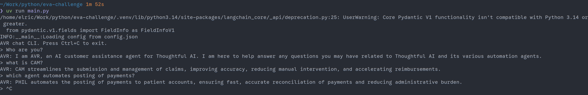

# Thoughtful AI Challenge

Simple CLI chat app that loads a JSON config, sends messages through the LLM pipeline, and prints responses in the terminal.

Uses OpenRouter by default, but extending to support other providers should be trivial as this uses LangChain.



## Setup

1. Create a `config.json` in the project root (or use `--config` to point elsewhere).
2. Provide your API key in the config file.

Example:

```json
{
  "llm": {
    "model": "gpt-3.5-turbo",
    "model_provider": "openai",
    "api_key": "YOUR_API_KEY"
  },
  "avr_questions": [...]
}
```

## Run

This project uses `uv`. Please follow instructions to install uv [here](https://docs.astral.sh/uv/getting-started/installation/).
```bash
uv run main.py --config config.json
```

## Improvements

- [ ] Add support for other LLM providers
- [ ] Use a single System message that is generated and cached on startup.
- [ ] Use tool calling to validate if user question is about ThoughtfulAI or not
